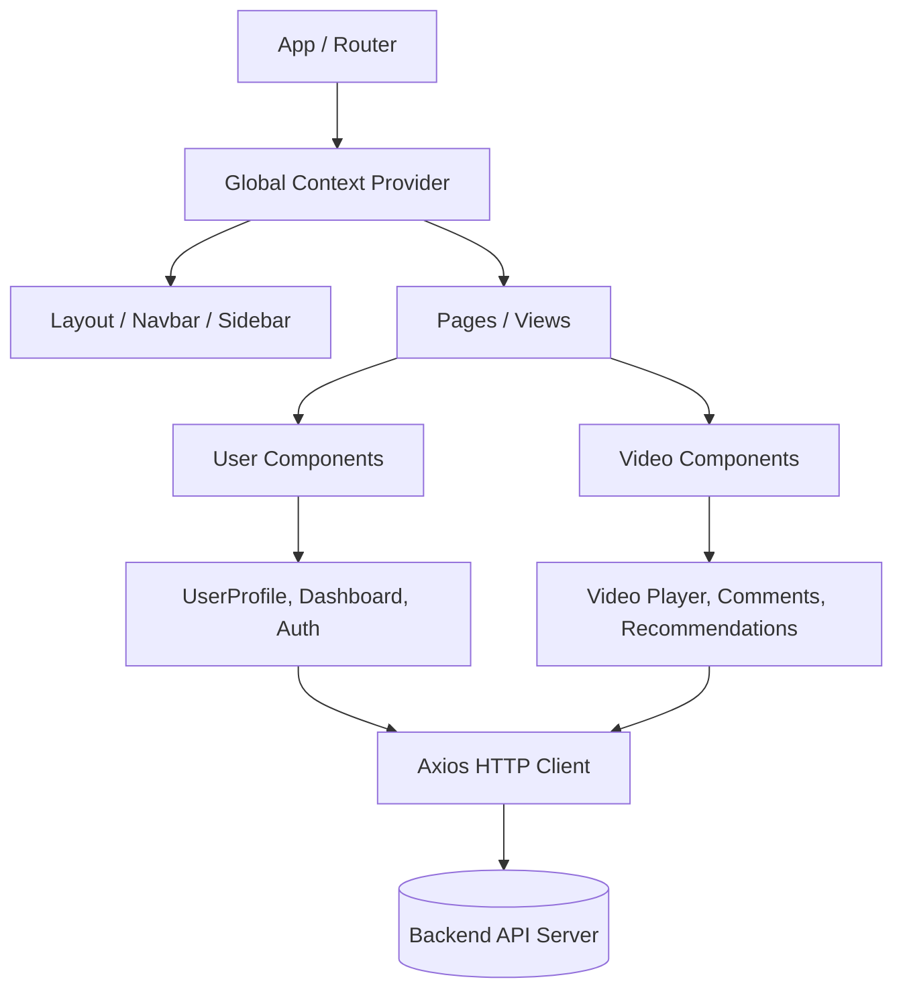

# Video Sharing Platform (Frontend)

Welcome to the frontend application of the Video Sharing Platform (YouTube Clone). This project is built using React, Vite, and tailwind for a highly interactive and modern user experience.

## 🚀 Tech Stack

- **Framework:** React 19 + Vite
- **Routing:** React Router DOM
- **Styling:** Tailwind CSS, tailwindcss-animate
- **UI Components:** Radix UI primitives & Shadcn UI architecture (lucide-react, react-icons)
- **Forms & Validation:** React Hook Form + Zod resolvers
- **HTTP Client:** Axios
- **State Management:** React Context API
- **Notifications:** React Hot Toast

---

## 🏗️ Architecture Diagram

The application uses a standard React component hierarchy hooked into Context for global state, with a dedicated routing layer and service endpoints that abstract HTTP calls to the backend.



---

## 📁 Project Structure

```text
src/
├── allComponents/         # Main application components
│   ├── ui/                # Reusable base UI components (Shadcn UI structure)
│   ├── userComponents/    # User-centric features
│   │   ├── Login, Signup, Navbar, Hero
│   │   ├── UserProfile, UserDashboard, UsersSettings
│   │   ├── Uploadvdo, SubcribedChannel, PlaylistComponents
│   └── vdoComponents/     # Video-centric features
│       ├── AllVdo, Showvdo, Card_for_vd0, Sidevdoinvdo
│       ├── VdoFunc (Like, Share, etc.)
│       └── Vdocomments (Comment system)
├── Context/               # React Context providers for global state
├── lib/                   # Utility functions (e.g., tailwind-merge utilities)
├── App.jsx                # Main application component & routes
└── main.jsx               # Application entry point
```

---

## ✨ Key Features

- **Authentication System:** Secure Login and Signup functionality.
- **Video Discovery and Management:** 
  - Upload videos directly from the dashboard.
  - Browse available videos via feeds.
  - Recommended and related side-videos (`Sidevdoinvdo`).
- **User Engagement:** 
  - Like, dislike, and share functionalities (`VdoFunc`).
  - Read and post comments on videos (`Vdocomments`).
- **User Dashboard & Profile:** 
  - Manage uploaded videos, playlists, and channel settings.
- **Subscriptions & Playlists:** Subscribe to channels and create categorized video playlists.

---

## 🌍 Environment Setup

Create an `.env` (or `.env.local`) file in the root of your `frontend` directory. Add the required environment variables:

```env
# Example environment variables
VITE_API_BASE_URL=https://youtube-backend-vdcg.onrender.com/api/v1
# Add any other keys required by your application (e.g., Cloudinary configs, etc.)
```

> **Note**: Vite uses the `VITE_` prefix to expose variables to your client-side code.

---

## 🛠️ Getting Started

### Prerequisites

- Node.js (v18+ recommended)
- npm or yarn

### Installation

1. Clone the repository and navigate to the frontend folder.
2. Install the dependencies:
   ```bash
   npm install
   ```

### Running the Development Server

Start the Vite development server with Fast Refresh:
```bash
npm run dev
```
Your app will be available at `http://localhost:5173` by default.

### Build for Production

To create an optimized production build:
```bash
npm run build
```
To preview the generated production build:
```bash
npm run preview
```

---

## 🔌 API Documentation Interface

This application interacts with the backend platform API. Some common modules being consumed by the frontend include:

- **Users Module:** Authenticate, manage sessions, update user profile, avatar, cover image, and view watch history.
- **Videos Module:** Fetch video feeds, upload video files, toggle publish status.
- **Subscriptions Module:** Manage user channels, toggle subscriptions, and view subscriber count.
- **Comments Module:** Add, update, and delete comments on a specific video.
- **Likes Module:** Toggle likes for videos, comments, and tweets.
- **Playlists Module:** Create playlists, add/remove videos to playlists.

*(Note: Provide the Swagger/Postman API collection URL if available on the backend side so prospective developers can test endpoints directly.)*

---

## 🤝 Contributing Guide

We welcome contributions! Please follow these steps to contribute:

1. **Fork the Repository**
2. **Create a Feature Branch:** `git checkout -b feature/your-feature-name`
3. **Commit your Changes:** Write clear, concise commit messages.
   ```bash
   git commit -m "feat: adding new UI component for XYZ"
   ```
4. **Push to the Branch:** `git push origin feature/your-feature-name`
5. **Open a Pull Request:** Ensure your PR description explains what your changes do.

### Code Guidelines
- Keep components modular and reusable.
- Put common components in `allComponents/ui`.
- Follow the existing Tailwind CSS naming conventions for styles.
- Avoid introducing unnecessary dependencies without prior discussion.

---

## 📜 Linting & Code Quality

This project leverages specific ESLint rules provided by Vite's minimal setup. Type-aware linting can be integrated if migrating to TypeScript in the future to improve maintainability within production applications.